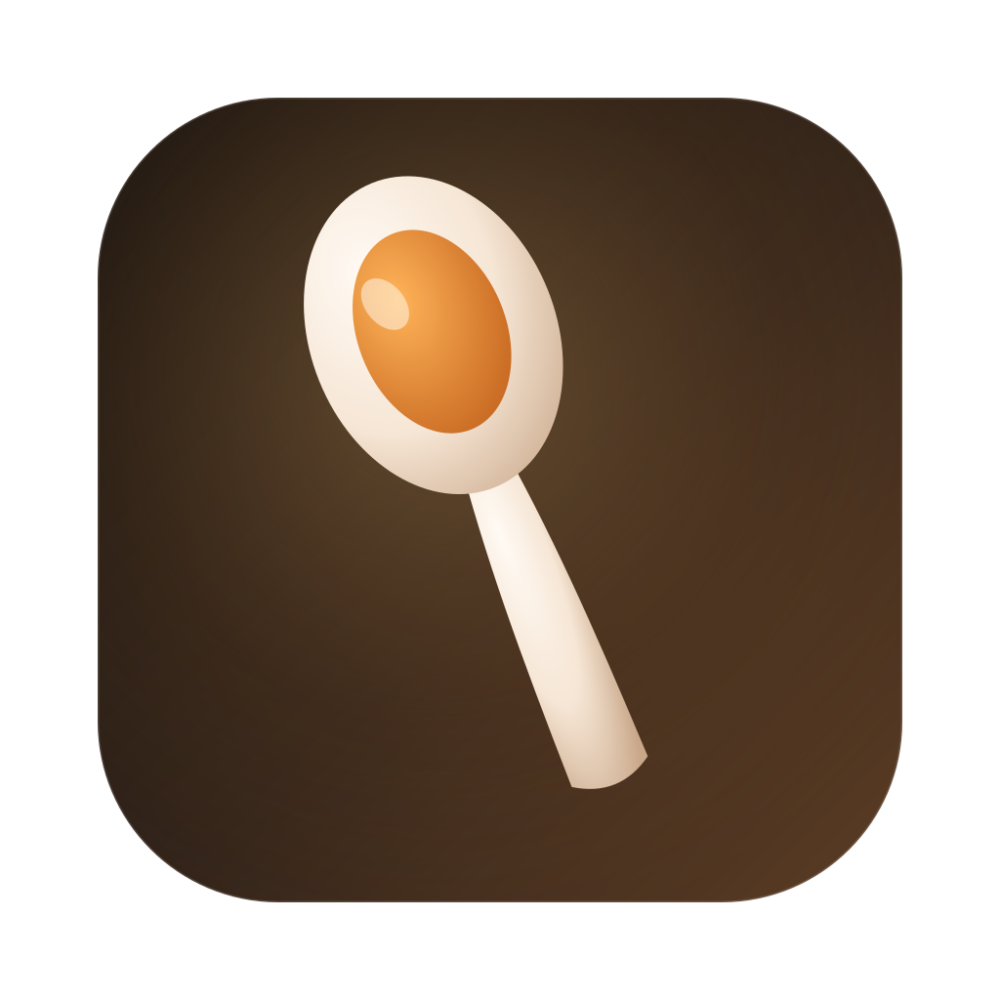

<div align="center">



# taste.md

**A Claude Code skill for making icons that are actually good.**<br>
*Invent an original mark that means two things at once, then render every platform size from one SVG.*

</div>

---

[taste.md](https://github.com/justin06lee/taste.md) turns Claude into an icon designer rather than an icon generator. It refuses to source existing artwork, forces a double-meaning metaphor before anything gets drawn, applies the craft rules that separate a deliberate mark from a template one, and produces every size every platform asks for — app icons, favicons, menu-bar glyphs, maskable PWA icons, `.icns`, `.ico`, the lot.

## Install

With [bmo](https://github.com/justin06lee/bmo):

```bash
bmo add justin06lee/taste.md
```

Or from a local clone:

```bash
bmo add ./taste.md        # everywhere (global)
bmo add ./taste.md here   # just this project
```

Installs as the `taste` skill (`/taste` in Claude Code). It also triggers on its own whenever icon work comes up — "make an app icon", "I need a favicon", "the tray icon looks bad at small sizes".

## Why icons come out generic

Three failures, in order of how often they happen:

| Failure | What it looks like | What the skill does |
|---|---|---|
| **Stock idea** | A gradient blob with a lightning bolt | Forces a written double-meaning metaphor before drawing |
| **Wrong canvas** | Crisp at 512, mud at 16 | Author at the largest target, bake in the platform grid, cut optical-size variants |
| **One file, many jobs** | A white menu-bar glyph that vanishes in light mode | Separate artwork per job, with the template-image rules spelled out |

## The part that matters

Step 2 is the whole skill. Before anything is drawn, two lists get written down:

- **Function** — what the thing does, in plain verbs
- **Identity** — the name, its origin, the reference, the joke

Then a single object that lands on **both** lists. That intersection is the mark.

> **Worked example.** Reze, a text expander named for a Chainsaw Man character.
> *Function:* type two words, get a paragraph — small input, big output.
> *Identity:* Reze is the Bomb Devil, pin in the neck.
> *Intersection:* **a pulled grenade pin.** Pull a tiny pin, get an explosion.
> It references the character and describes the app in one object.

The test is a single sentence naming both meanings. Cover only one and you have a pictogram (function alone) or fan art (identity alone). Both are forgettable.

The mark at the top of this README was drawn by following the same steps: a tasting spoon, because you judge a whole dish from one small spoonful the same way you judge a whole app from one small icon.

## What's covered

| Area | Contents |
|---|---|
| **Process** | Interrogate → double meaning → silhouette → canvas → draw → optical sizes → per-job artwork → generate → verify |
| **Platforms** | macOS (`.icns`, grid, menu-bar templates), iOS, Android adaptive, Windows (`.ico`, tiles, tray), Linux (hicolor, tray), web (favicon set, manifest, maskable, `apple-touch-icon`) |
| **Craft** | Form and optical centering, colour and gradient discipline, one light source, self-shading, legibility tests, small-size adaptation |
| **Pipeline** | `rsvg-convert` / `resvg` / `iconutil` / `icotool` / `oxipng` recipes, Tauri and Electron wiring, what to commit, how to verify |

Reference files load on demand, so the skill stays cheap until it's actually doing the work:

```
SKILL.md                        the process
references/platform-specs.md    every size, format, and grid rule
references/craft-rules.md       form, colour, light, legibility
references/pipeline.md          generation commands and framework wiring
```

## House rules it enforces

- **Never source, always invent.** No downloaded, traced, or embedded third-party artwork — it is someone else's copyright in your bundle, and it caps the work at retrieval.
- **Vector is the source of truth.** The SVG is committed and hand-edited; every raster is generated and never touched by hand.
- **Render each size from the SVG.** Never downscale a PNG to make another PNG.
- **Different jobs get different files.** A menu-bar glyph is not the app icon at 18px.
- **No palette reuse across projects.** Each mark comes from that project's own meanings.

## License

MIT — see [LICENSE](LICENSE).
